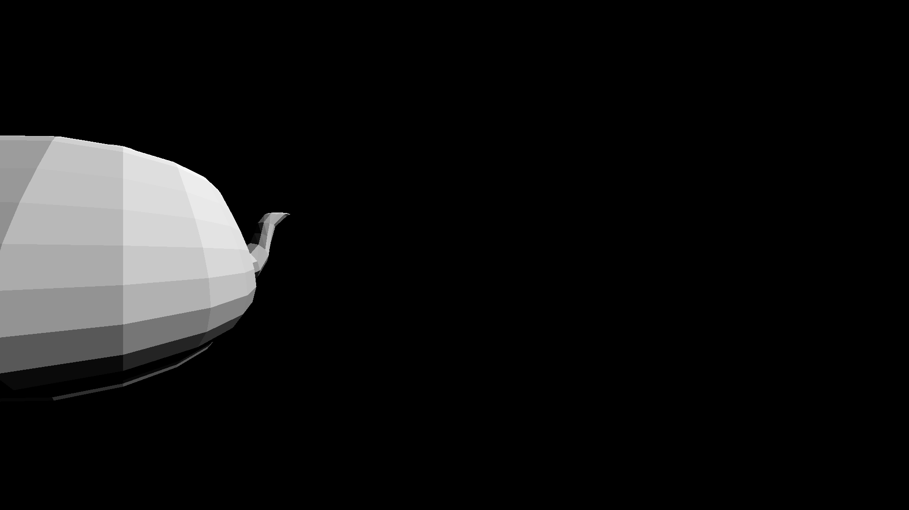
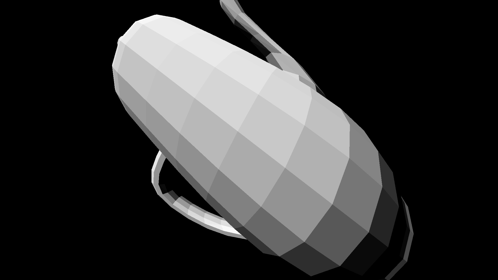

# Chaos Ray Tracing Course 2025

This repository contains my solutions to the assignments of the [Chaos Ray Tracing Course 2025](https://github.com/VladislavVulchevChaos/ChaosRayTracingCourse2025).

| Task                        | Source Code                                                                                                                  | Result                                                                                                                                                                                                                                                                                                                                                                                                                                                                                                                                                                                                                                                                                                                                                                                                                                                                                                                                                                                                                                                                                                                                                                                                                                                                                                                                                                                                                                                                      |
| :-------------------------- | :--------------------------------------------------------------------------------------------------------------------------- | --------------------------------------------------------------------------------------------------------------------------------------------------------------------------------------------------------------------------------------------------------------------------------------------------------------------------------------------------------------------------------------------------------------------------------------------------------------------------------------------------------------------------------------------------------------------------------------------------------------------------------------------------------------------------------------------------------------------------------------------------------------------------------------------------------------------------------------------------------------------------------------------------------------------------------------------------------------------------------------------------------------------------------------------------------------------------------------------------------------------------------------------------------------------------------------------------------------------------------------------------------------------------------------------------------------------------------------------------------------------------------------------------------------------------------------------------------------------------- |
| 02 Fundamentals: Task 1     | [main.cpp](https://github.com/bvpav/chaos-ray-tracing-course-2025/blob/02-01-rectangle-grid/src/main.cpp)                    |                                                                                                                                                                                                                                                                                                                                                                                                                                                                                                                                                                                                                                                                                                                                                                                                                                                                                                                                                                                                                                                                                                                                                                                                                                                                                                                                                                     |
| 02 Fundamentals: Task 2     | [main.cpp](https://github.com/bvpav/chaos-ray-tracing-course-2025/blob/02-02-circle/src/main.cpp)                            |                                                                                                                                                                                                                                                                                                                                                                                                                                                                                                                                                                                                                                                                                                                                                                                                                                                                                                                                                                                                                                                                                                                                                                                                                                                                                                                                                                                     |
| 03 Rays: Task 1             | [src/](https://github.com/bvpav/chaos-ray-tracing-course-2025/tree/03-01-camera-rays/src)                                    |                                                                                                                                                                                                                                                                                                                                                                                                                                                                                                                                                                                                                                                                                                                                                                                                                                                                                                                                                                                                  |
| 04 Triangle 01: Task 1      | [crt_triangle.h](https://github.com/bvpav/chaos-ray-tracing-course-2025/blob/04-01-triangle-primitive/src/crt_triangle.h)    | N/A                                                                                                                                                                                                                                                                                                                                                                                                                                                                                                                                                                                                                                                                                                                                                                                                                                                                                                                                                                                                                                                                                                                                                                                                                                                                                                                                                                                                                                                                         |
| 04 Triangle 01: Task 2      | [main.cpp](https://github.com/bvpav/chaos-ray-tracing-course-2025/blob/04-02-vector-cross-product-calculations/src/main.cpp) | • AxB = (0, 0, 12.25) • AxB = (-18, -5, 39) • Area = 43.2435 • Area = 0                                                                                                                                                                                                                                                                                                                                                                                                                                                                                                                                                                                                                                                                                                                                                                                                                                                                                                                                                                                                                                                                                                                                                                                                                                                                                                                                                                                            |
| 04 Triangle 01: Task 3      | [main.cpp](https://github.com/bvpav/chaos-ray-tracing-course-2025/blob/04-03-triangle-calculations/src/main.cpp)             | • Normal = (0, 0, 1)   • Area = 6.125   • Normal = (0, -1, 0)   • Area = 2   • Normal = (0.75642, 0.275748, -0.59312)   • Area = 6.11862                                                                                                                                                                                                                                                                                                                                                                                                                                                                                                                                                                                                                                                                                                                                                                                                                                                                                                                                                                                                                                                                                                                                                                                                                                                                                                                     |
| 05 Triangle 02: Task 1      | [src/](https://github.com/bvpav/chaos-ray-tracing-course-2025/tree/05-01-given-triangle-intersection/src)                    |                                                                                                                                                                                                                                                                                                                                                                                                                                                                                                                                                                                                                                                                                                                                                                                                                                                                                                                                                                                                                                                                                                                                                                                                                                                                                                                                            |
| 05 Triangle 02: Task 2      | [src/](https://github.com/bvpav/chaos-ray-tracing-course-2025/tree/05-02-custom-triangle-intersection/src)                   |                                                                                                                                                                                                                                                                                                                                                                                                                                                                                                                                                                                                                                                                                                                                                                                                                                                                                                                                                                                                                                                                                                                                                                                                                                                                                                                                          |
| 05 Triangle 02: Task 3      | [src/](https://github.com/bvpav/chaos-ray-tracing-course-2025/tree/05-03-many-triangles/src)                                 |                                                                                                                                                                                                                                                                                                                                                                                                                                                                                                                                                                                                                                                                                                                                                                                                                                                                                                                                                                                                                                                                                                                                                                                                                                                                                                                                                                      |
| 05 Triangle 02: Task 4      | [src/](https://github.com/bvpav/chaos-ray-tracing-course-2025/tree/05-04-teapot/src)                                         |                                                                                                                                                                                                                                                                                                                                                                                                                                                                                                                                                                                                                                                                                                                                                                                                                                                                                                                                                                                                                                                                                                                                                                                                                                                                                                                                                                                      |
| 06 Camera Animation: Task 1 | [src/](https://github.com/bvpav/chaos-ray-tracing-course-2025/tree/06-01-pan/src)                                            |                                                                                                                                                                                                                                                                                                                                                                                                                                                                                                                                                                                                                                                                                                                                                                                                                                                                                                                                                                                                                                                                                                                                                                                                                                                                                                                                                                                       |
| 06 Camera Animation: Task 2 | [src/](https://github.com/bvpav/chaos-ray-tracing-course-2025/tree/06-02-translated-camera/src)                              |                                                                                                                                                                                                                                                                                                                                                                                                                                                                                                                                                                                                                                                                                                                                                                                                                                                                                                                                                                                                                                                                                                                                                                                                                                                                                                                                                           |
| 06 Camera Animation: Task 3 | [src/](https://github.com/bvpav/chaos-ray-tracing-course-2025/tree/06-03-camera-animation/src)                               |                                                                                                                                                                                                                                                                                                                                                                                                                                              |
| 06 Camera Animation: Task 4 | [src/](https://github.com/bvpav/chaos-ray-tracing-course-2025/tree/06-04-camera-animation/src)                               |        |
| 06 Camera Animation: Task 5 | [src/](https://github.com/bvpav/chaos-ray-tracing-course-2025/tree/06-05-turntable/src)                                      |                                                                                                                                                                                                                                                                                                                                                                                                                                                                                                                                                                                                                                                                                                                                                                                                                                                                                                                                                                                                                                                                                                                                                                                                                                                                                                                                                                |
| 07 Scene: Task 1            | [src/](https://github.com/bvpav/chaos-ray-tracing-course-2025/tree/07-01-scene/src)                                          |                                                                                                                                                                                                                                                                                                                                                                                                                                                                                                                                                                                                                                                                                                                                                                                                                                                                                                                                        |
| 08 Light: Task 1            | [src/](https://github.com/bvpav/chaos-ray-tracing-course-2025/tree/08-01-light/src)                                          |                                                                                                                                                                                                                                                                                                                                                                                                                                                                                                                                                                                                                                                                                                                                                                                                                                                                                                                                                                                                                                                |
| 09 Shading 01: Task 1       | [src/](https://github.com/bvpav/chaos-ray-tracing-course-2025/tree/09-01-barycentric-coordinates/src)                        |                                                                                                                                                                                                                                                                                                                                                                                                                                                                                                                                                                                                                                                                                                                                                                                                                                                                                                                                                                                                                                                                                                                                                                              |
| 09 Shading 01: Task 2       | [src/](https://github.com/bvpav/chaos-ray-tracing-course-2025/tree/09-02-diffuse-smooth-shading/src)                         |                                                                                                                                                                                                                                                                                                                                                                                                                                                                                                                                                                                                                                                                                                                                                                                                                                                                                                                                                                                                                                                                                                                                                                                  |
| 09 Shading 01: Task 3       | [src/](https://github.com/bvpav/chaos-ray-tracing-course-2025/tree/09-03-reflective/src)                                     |                                                                                                                                                                                                                                                                                                                                                                                                                                                                                                                                                                                                                                                                                                                                                                                                                                                                                                                                                                                                                                                                                                                                                                                                                                  |
| 11 Shading 03: Task 1       | [src/](https://github.com/bvpav/chaos-ray-tracing-course-2025/tree/11-01-refractive/src)                                     |                                                                                                                                                                                                                                                                                                                                                                 |
| 12 Textures: Task 1         | [src/](https://github.com/bvpav/chaos-ray-tracing-course-2025/tree/12-01-textures/src)                                       |                                                                                                                                                                                                                                                                                                                                                                                                                                                                                                                                                                                                                                                                                                                                                                                                                                                                                           |
