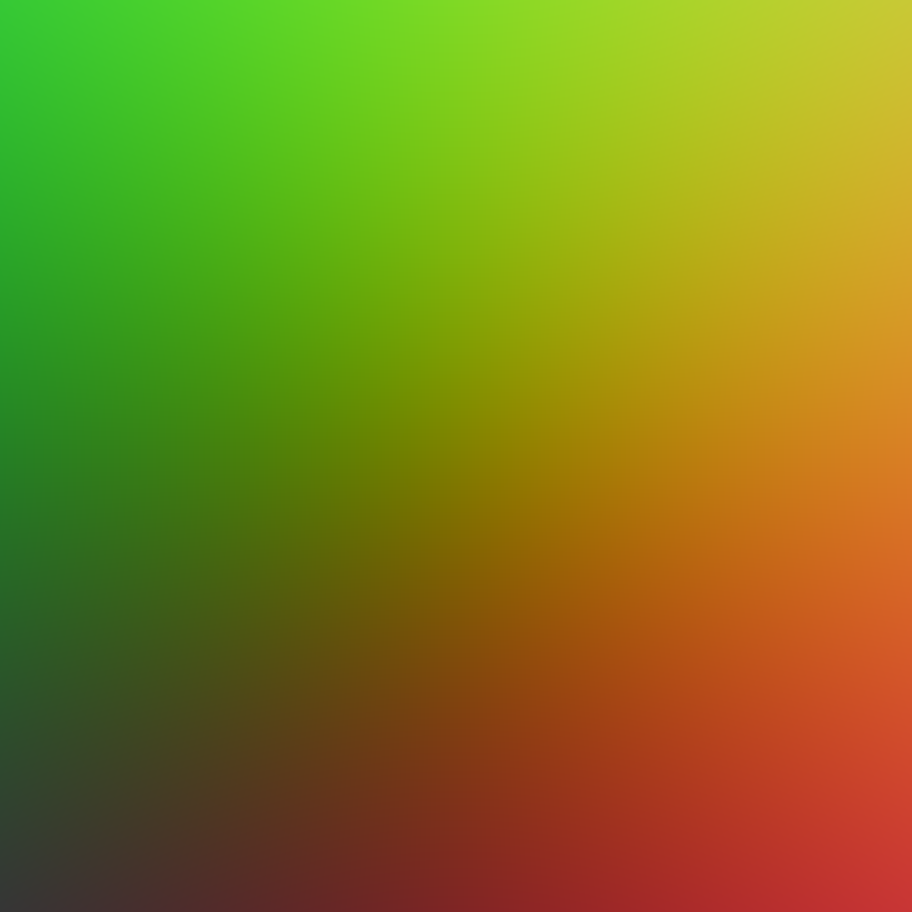

# Chaos Ray Tracing Course 2025

This repository contains my solutions to the assignments of the [Chaos Ray Tracing Course 2025](https://github.com/VladislavVulchevChaos/ChaosRayTracingCourse2025).

| Task                    | Source Code                                                                                                                  | Result                                                                                                                                                                                                                                                                                                                                                                                                                                                                         |
| :---------------------- | :--------------------------------------------------------------------------------------------------------------------------- | ------------------------------------------------------------------------------------------------------------------------------------------------------------------------------------------------------------------------------------------------------------------------------------------------------------------------------------------------------------------------------------------------------------------------------------------------------------------------------ |
| 02 Fundamentals: Task 1 | [main.cpp](https://github.com/bvpav/chaos-ray-tracing-course-2025/blob/02-01-rectangle-grid/src/main.cpp)                    |                                                                                                                                                                                                                                                                                                                                                                        |
| 02 Fundamentals: Task 2 | [main.cpp](https://github.com/bvpav/chaos-ray-tracing-course-2025/blob/02-02-circle/src/main.cpp)                            |                                                                                                                                                                                                                                                                                                                                                                                        |
| 03 Rays: Task 1         | [src/](https://github.com/bvpav/chaos-ray-tracing-course-2025/tree/03-01-camera-rays/src)                                    |     |
| 04 Triangle 01: Task 1  | [crt_triangle.h](https://github.com/bvpav/chaos-ray-tracing-course-2025/blob/04-01-triangle-primitive/src/crt_triangle.h)    | N/A                                                                                                                                                                                                                                                                                                                                                                                                                                                                            |
| 04 Triangle 01: Task 2  | [main.cpp](https://github.com/bvpav/chaos-ray-tracing-course-2025/blob/04-02-vector-cross-product-calculations/src/main.cpp) | • AxB = (0, 0, 12.25) • AxB = (-18, -5, 39) • Area = 43.2435 • Area = 0                                                                                                                                                                                                                                                                                                                                                                                               |
